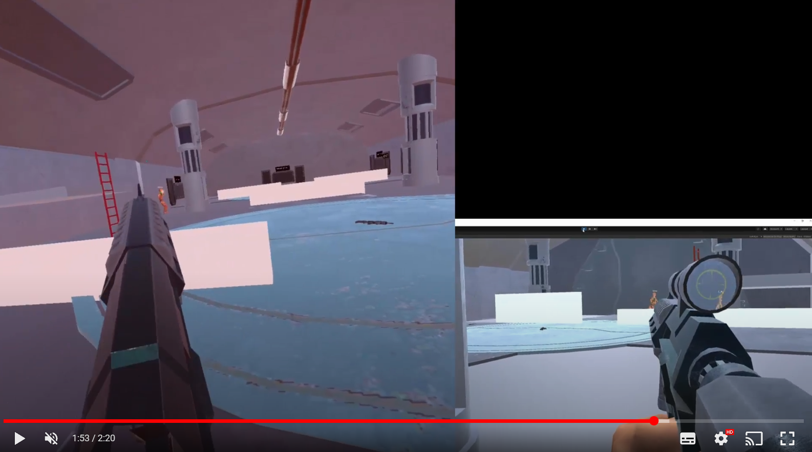

IMPORTANT
==============
In order to use this you will need [Final IK](https://assetstore.unity.com/packages/tools/animation/final-ik-14290) and [Photon](https://assetstore.unity.com/packages/tools/network/pun-2-free-119922)

VR Shooter Kit Multiplayer
==============

VR Shooter Kit Multiplayer, is a extension for [VR Shooter Kit]https://github.com/platinio/VRShooterKit) in order to handle multiplayer, it uses VR IK system in order to create avatars that try to
imitate your real movements, so you can see others peoples body interact, shoot and play.

[Youtube Video](https://youtu.be/3xLznTga-6s) 

Installation
==============

Inside Assets/VRShooterKitMultiplayer you can find the installation guide, but before doing so all around VR Shooter Kit uses [Git - Submodules](https://git-scm.com/book/en/v2/Git-Tools-Submodules) 
so you need to init the git modules using `$ git submodule init` and `$ git submodule update` after running those two git commands you are ready to go.

